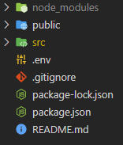

# Setup `hub-app`

**Before continuing make sure you have finished all of `hub-api` readme and `hub-api` is actively running on port 3001**

- clone this repository to your local computer: `git clone https://github.com/standeraumich/ece574_hub-api.git`
- In an IDE of choice (I’m using VSCode) open the `ece574_hub-app` so your working directory looks like this:
    
    
    
- If needed, edit the contents of `.env` to represent your local computer’s ip address, `.env`'s default is `localhost`
- in a terminal opened to the same directory, run `npm install`
- then run: `npm start`
- Your app should run on [localhost](http://localhost) and pull the latest sensor data from `hub-api` every 5 seconds and updates its widgets with any new data that comes in